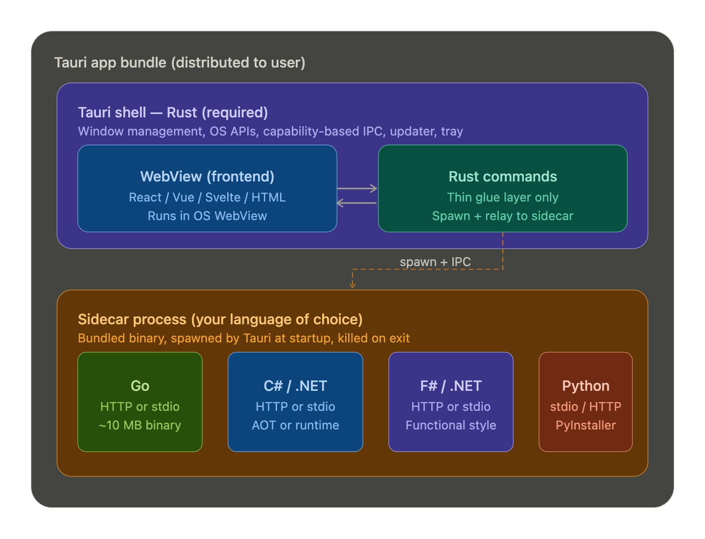

Tauri's architecture is more flexible than most people realize. Tauri's core is Rust and that's non-negotiable for the shell itself — but your *application logic* can absolutely live in Go, C#, F#, or any other language via a sidecar process pattern. Here's how it works architecturally:

The key insight is the **sidecar pattern**: Tauri's Rust shell stays thin and handles only what it must (window, IPC security, OS integration), while your real business logic runs in a separately compiled binary that Tauri bundles, spawns, and kills alongside the app.

Here's how each language option plays out in practice:

**Go** is the smoothest fit. You compile a single static binary, Tauri bundles it inside the installer, and the two processes talk over either stdio (simplest) or a local HTTP port. The result is still a very lean app — Go + Tauri combined stays around 15–20 MB. This is effectively what Wails does under the hood, except here you control the split manually.

**C# and F# (.NET)** are fully viable, with one important consideration: distribution. You have two paths. The first is publishing a self-contained .NET binary (using `dotnet publish -r win-x64 --self-contained`), which bundles the .NET runtime — this adds ~50–80 MB to your installer but needs nothing pre-installed. The second is using .NET Native AOT, available since .NET 7/8, which compiles to a native binary similar to Go and keeps the footprint small (~10–20 MB). F# works identically to C# here since they both target the same .NET runtime. The IPC story is the same: local HTTP (ASP.NET Minimal API is great for this) or stdio.

**The IPC bridge** between Tauri's Rust commands and your sidecar is deliberately simple. The Rust side spawns the process using Tauri's `shell` plugin with `sidecar()`, then either relays messages over stdio or opens a localhost HTTP connection. Your frontend JavaScript never talks to the sidecar directly — it calls Tauri commands, which proxy to the sidecar. This preserves Tauri's security model completely.

The one genuine tradeoff: you're writing a small amount of Rust glue code regardless. It's usually under 100 lines — just the process spawn logic and command relay — but you can't entirely escape Rust. If that's a dealbreaker, Wails (Go only) or a custom Electron app is cleaner.

For .NET specifically, the recommended stack would look like: Tauri shell (Rust, minimal) + React or Svelte frontend + C#/F# ASP.NET Minimal API sidecar compiled as AOT. This gives you the full .NET ecosystem for business logic, a modern web UI, and a Tauri security model and installer — with a final installer in the 30–60 MB range, which is far better than Electron's 150+ MB.

Want me to sketch out the actual code structure for any of these combinations — for example, a Tauri + C# AOT sidecar with a local HTTP bridge?